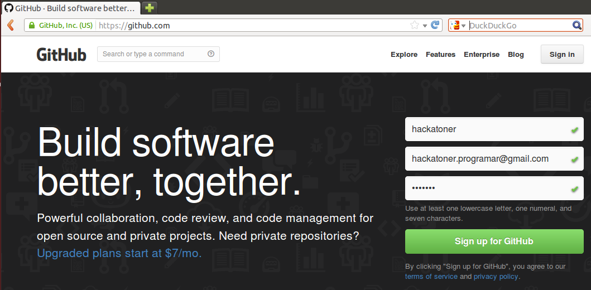
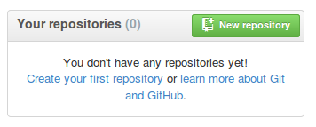
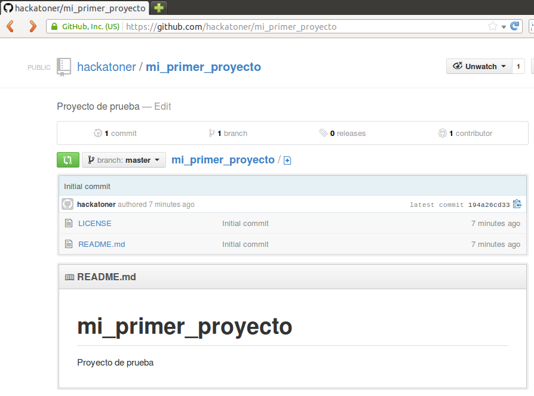
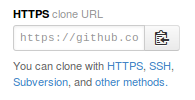

Cómo publicar tu aplicación en github
=====================================

Para participar del hackaton de datos programAR necesitarás publicar tu trabajo publicar tu trabajo en un repositorio de github bajo una [licencia libre](http://www.gnu.org/licenses/license-list.html#GPLCompatibleLicenses) reconocida por la [Free Software Foundation](http://www.fsf.org/), como la [GPLv3](http://www.gnu.org/licenses/gpl.html).

Aquí te explicaremos cómo hacerlo

Instalando git
--------------

Si estás utilizando Ubuntu (o cualquier otra distribución basada en Debian) sólo tienes que abrir una ventana de comandos, y ejecutar la siguiente orden:

```
$ sudo apt-get install git
```

Si estás usando Fedora (o cualquier otra distribución que use paquetes rpm) deberás abrir una ventana de comandos e ingresar:

```
$ yum install git-core
```

Luego deberás [configurar git](http://git-scm.com/book/es/Empezando-Configurando-Git-por-primera-vez). Ingresa los siguientes comandos para configurar tu nombre de usuario y dirección de correo electrónico.

```
$ git config --global user.name "mi nombre de usuario"
$ git config --global user.email mi_mail@ejemplo.com
```

Y agregar también las siguientes configuraciones para git te muestre la salida en pantalla utilizando colores y para establecer cómo queremos que git actualize ramas remotas (más información <a href='http://stackoverflow.com/a/13148313/47633'>aquí</a>):

```
$ git config --global color.ui true
$ git config --global push.default simple
```

Registrar una cuenta en github
------------------------------

Para registrar una cuenta en github navegá a https://github.com, ingresá tu nombre de usuario, dirección de correo y una clave, y luego hacé click en *Sign up for GitHub*.



Para crear nuestr proyecto, hacemos click en 'New repository', abajo a la derecha, y completamos la información de nuestro proyecto.



Creando nuestro primer proyecto

Aseguráte de elegir una licencia libre para tu proyecto. Si tenés alguna duda la [GPLv3](http://www.gnu.org/licenses/gpl.html) será suficiente.

Luego hacemos click en *Create repository*.



Github también ha creado para nosotros un url, en este ejemplo: https://github.com/hackatoner/mi_primer_proyecto. Esta es la dirección de nuestro proyecto en github que deberás informar a los organizadores del hackton.

Clonando localmente nuestro repositorio
---------------------------------------

Para trabajar en tu proyecto deberás clonar el repositorio de github en tu estación de trabajo.

Copiá la dirección que se encuentra en la parte inferior derecha de la página de nuestro proyecto:



Abrí una consola, y ejecutá el siguiente comando:

```
$ git clone https://github.com/tu_usuario_de_github/tu_proyecto.git
```

Flujo de trabajo con git
------------------------

Cada vez agregues un nuevo archivo, o modifiques uno ya existente, deberás indicarle a git que lo incluya para ser grabado (commit) con el comando ```git add```.

Por ejemplo, luego de modificar el archivo *README.md* tendrás que preparlo (stage) para ser grabado (commit) con el siguiente comando:

```
$ git add README.md
$ git status
# En la rama master
# Cambios para hacer commit:
#   (use «git reset HEAD <archivo>...«para eliminar stage)
#
# modificado:   README.md
```

Para grabarlo tendrás que usar el comando ```git commit``` pasando un mensaje mediante el parámetro ```-m```.

```
$ git commit -m 'actualizamos el archivo README.md'
[master 981d17b] completamos el archivo README.md
 1 file changed, 1 insertion(+), 1 deletion(-)
```

Finalmente, para enviar los cambios que acabamos de confirmar (commit) en nuestro repositorio local a nuestro repositorio remoto en github, utiliaremos el comando ```git push```.

```
$ git push
Username for 'https://github.com': tu_usuario_de_github
Password for 'https://hackatoner@github.com': tu_clave_de_github

Counting objects: 8, done.
Compressing objects: 100% (6/6), done.
Writing objects: 100% (6/6), 670 bytes, done.
Total 6 (delta 1), reused 0 (delta 0)
To https://github.com/hackatoner/mi_primer_proyecto.git
   194a26c..d6d9019  master -> master
```

¡Ya está! Acabás de realizar tu primer commit en github.

Esta es una guía sumamente resumida para que puedas comenzar a trabajar en tu proyecto lo antes posible.

Si querés una explicación más detallada no dejes de leer [este artículo](github.md).

No olvides que durante el hackaton habrá mentores para ayudarte con estas cuestiones.
