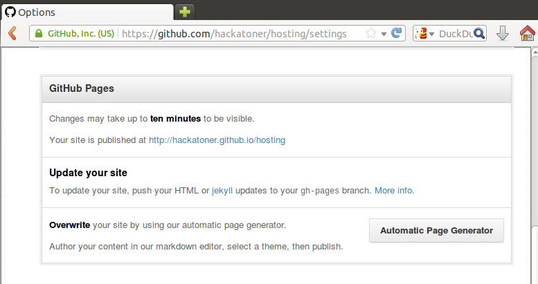
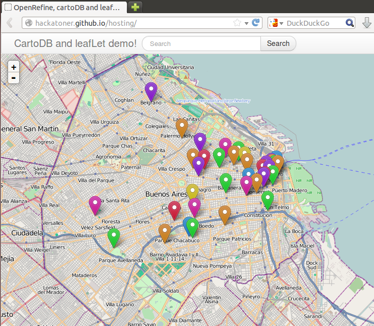

Cómo alojar tus aplicaciones en github
======================================

<a href='#tldr'>tl;dr</a> (está bien, ya conozco la teoría, quiero el <a href='#tldr'>resumen</a> ayuda-memoria)

Github como servidor de aplicaciones
------------------------------------

Github es un sitio web que te permite alojar el *código fuente* de tus aplicaciones, brindando además prestaciones propias de las redes sociales.

No se trata de un servicio de hosting completo que te permita ejecutar código del lado del servidor (como podría ser una aplicación hecha con php, ruby o python, por ejemplo).

Sin embargo, si tu aplicación está compuesta únicamente por páginas estáticas (html, css, javascript) puedes aprovechar [Github pages](http://pages.github.com/) y usar GitHub para alojar tu aplicación.

Aplicaciones del lado del cliente
---------------------------------

En los últimos tiempos han surgido una serie de aplicaciones desarrolladas con html, css y javascript que simplemente se limitan a consumir servicios web desde el lado del cliente. Se trata de hecho de páginas estáticas que no necesitan ejecutar páginas desde el servidor, todo el procesamiento ocurre en el explorador web del usuario.

En el caso particular aplicaciones o visualizaciones de open data, es común tomar los datasets y luego exponerlos a través de un web service o simplemente incluir la información en json en el código de tu aplicación.

En todos estos casos, podrás utilizar [Github pages](http://pages.github.com/) para publicar tu aplicación.

Github Pages
------------

Pues bien, arrancaremos con un repositorio en github en donde tenemos una aplicación estática (html + css + js) que no requiere procesamiento del lado del servidor.

El proyecto es simplemente una aplicación que accede a una lista de contactos a través de un web service expuesto en [CartoDB](http://cartodb.com/) y lo muestra en un mapa utilizando la librería [LeafLet](http://leafletjs.com/).

> Si te interesa la aplicación aquí hay una [serie de artículos](http://opensas.wordpress.com/2013/06/27/journey-to-the-open-data-jungle-with-openrefine-cartodb-leaflet-and-javascript/) en la que explico paso a paso como desarrollarla.

El web service es de acceso público y pueden probarlo mediante la siguiente consulta: [http://devel.cartodb.com/api/v2/sql?q=select * from my_contacts](http://devel.cartodb.com/api/v2/sql?q=select * from my_contacts)

La aplicación consiste en arhivos html, css y js, y no requiere ningún procesamiento del lado del servidor, todo ocurre del lado del cliente.

Gracias a esto es que podemos usar [GitHub Pages](http://pages.github.com/) para alojarla.

Lo primero que haremos será [habilitar GitHub Pages](https://help.github.com/articles/creating-project-pages-manually). Para ello tenemos que crear una *rama* de git que se llame *gh-pages*, y ahí pondremos el contenido que querramos que GitHub publique.

Primero clonamos localmente nuestro proyecto de GitHub:

```
$ git clone https://github.com/hackatoner/hosting.git
$ cd hosting
```

Luego creamos una rama [*huérfana*](http://robots.thoughtbot.com/post/49004256633/its-for-the-orphans) llamada *gh-pages*

```
$ git checkout --orphan gh-pages
Switched to a new branch 'gh-pages'
```

Y guardamos los cambios

```
hackatoner@station:~/proyectos/hosting$ git commit -m 'creamos la rama gh-pages'
[gh-pages (root-commit) 1ee8dd4] creamos la rama gh-pages
 8 files changed, 901 insertions(+)
 create mode 100644 LICENSE
 create mode 100644 README.md
 create mode 100644 index.html
 create mode 100644 js/bootstrap.min.js
 create mode 100644 js/cartodbData.js
 create mode 100644 js/leaflet.css.min.js
 create mode 100644 js/leaflet.sprite.js
 create mode 100644 js/leaflet.sprite.min.js
```

Finalmente, enviamos los cambios de nuestro repositorio local al repositorio remoto de GitHub y configuramos nuestra rama local gh-pages para que siga la rama remota gh-pages de GitHub:

```
hackatoner@station:~/proyectos/hosting$ git push --set-upstream origin gh-pages
Username for 'https://github.com': hackatoner
Password for 'https://hackatoner@github.com':
Counting objects: 11, done.
Compressing objects: 100% (11/11), done.
Writing objects: 100% (11/11), 70.81 KiB, done.
Total 11 (delta 1), reused 0 (delta 0)
To https://github.com/hackatoner/hosting.git
 * [new branch]      gh-pages -> gh-pages
Branch gh-pages set up to track remote branch gh-pages from origin.
```

Si visitamos nuestro repositorio en GitHub, y hacemos click en *Settings*, veremos que GitHub recibió la nueva rama *gh-pages* y nos avisa que en 10 minutos estará disponible:



Luego de unos instantes, podremos visitar http://hackatoner.github.io/hosting y veremos nuestra aplicación en acción:



Ahora podemos segir trabajando en nuestra rama de desarrollo, y cada vez que querramos publicar en github nuestra aplicacion, debemos pasar los cambios a la rama gh-pages y luego hacer un ```git push``` de esa rama.

Supongamos que hemos hecho cambios en nuestra rama *master* y que los queremos poner en producción. Los cambios ya han sido guardados (commit) en la rama *master* y ahora debemos pasarlos a la rama *gh-pages*.

```
$ git checkout gh-pages
$ git merge master
$ git commit -m 'nuevos cambios pasados a la rama gh-pages'
$ git push
```


---
